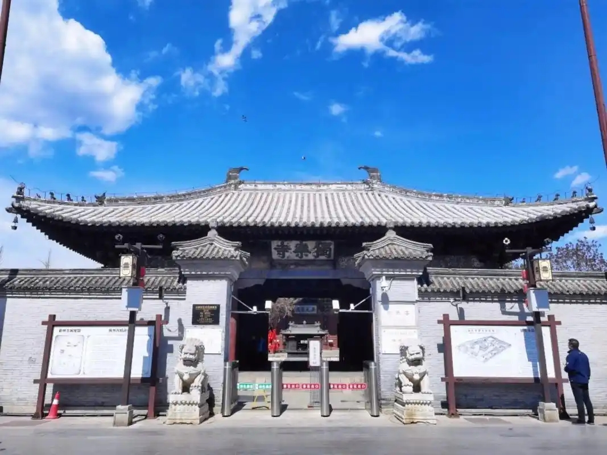

# C 题：蓟州区旅游经济发展趋势预测与对策分析

> 题目来源：第一届天津市五校数学建模联赛
>
> 转换说明：已按要求尝试使用 MinerU。无 Token 的快速解析因当前环境 DNS 无法解析 `mineru.net` 失败；使用用户提供的 Token 并申请联网后，服务端返回 HTTP 401（`user authenticate failed`）。因此当前文件是同一 PDF 使用本地 `pdfminer.six` 的回退提取结果，未伪称为 MinerU 输出。

## 题目背景

蓟州区（原蓟县）位于天津市北部，是首批国家全域旅游示范区，拥有盘山、黄崖关长城、独乐寺等知名景区，素有“京津后花园”之称。近年来，蓟州区将文化旅游产业作为“一号亮点”和支柱产业，第三产业占比已达 62.6%（2025 年）。面向“十五五”时期，当地明确提出加快文旅产业全域、全季、全产业链升级的目标。

结合蓟州区旅游经济发展的历史数据与现状，请建立数学模型，完成以下问题。

## 问题 1

搜集蓟州区 2010 年（或尽可能早）至 2025 年的旅游经济相关数据和与旅游经济密切相关的数据，例如年度旅游接待人次、旅游综合收入、地区生产总值（GDP）及第三产业增加值等数据。对数据进行清洗、补缺和可视化分析，识别其长期趋势及异常波动（如 2020—2022 年疫情冲击）。建立至少一种简单的增长模型，初步刻画旅游经济的发展态势，并评价该模型的适用性。

## 问题 2

选取合适的时间序列分析或回归方法，建立旅游接待人次和旅游综合收入的预测模型。要求：

1. 说明模型选择的依据，并对模型进行参数估计与统计检验；
2. 利用所建模型预测 2026—2030 年的旅游接待人次和综合收入，给出具体预测值及其 95% 置信区间；
3. 对预测结果的合理性进行分析，并与问题 1 中的初步模型进行对比，评估模型优劣。

## 问题 3

考虑到政策导向与外部不确定性，请设置基准情景（自然延续）、乐观情景（“十五五”文旅升级政策全面落地、京津冀协同深化）和悲观情景（宏观经济下行或突发公共事件）三种发展情景，分别预测未来五年趋势。

进一步，对关键影响因素（如政策投入力度、客源市场变化、新业态发展速度等）进行敏感性分析，识别驱动旅游经济发展的核心因素。基于全部模型结论，为蓟州区未来旅游经济发展提出 3—5 条定量化、可操作的对策建议，并说明建议的预期效果。

## 补充说明

参赛者可通过以下公开渠道自行搜集所需数据。除天津市统计局、天津市文化和旅游局官网等常规渠道外，建议重点使用蓟州区人民政府官网的数据发布平台。以下列出若干具体入口供参考：

- **2025 年年度核心经济数据（统计公报）**：<https://www.tjjz.gov.cn/zwgk/sjfb/tjgb/202606/t20260629_7325623.html>
- **2024 年综合统计资料（统计年鉴）**：<https://www.tjjz.gov.cn/zwgk/sjfb/tjnb/202511/t20251126_7185954.html>
- **历年月度、季度高频数据（统计月报专栏）**：<https://www.tjjz.gov.cn/zwgk/sjfb/>
- **2024 年 1 月至 12 月统计资料**：<https://www.tjjz.gov.cn/zwgk/sjfb/tjyb/202501/t20250123_6842681.html>

以上链接为示例性入口。因政府网站可能不定期改版，具体页面地址可能发生变化。参赛者应以官网“政务公开 → 数据发布”栏目为主要检索路径，主动查找最新的数据版本，并在论文中注明所有数据的实际获取日期。

政策文件方面，可参考《天津市蓟州区 2025 年政府工作报告》及“十五五”发展规划相关发布。
