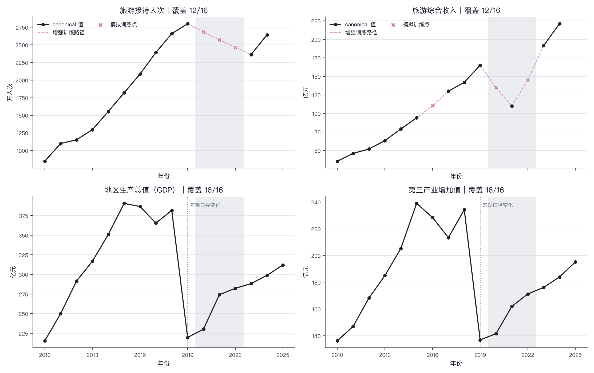
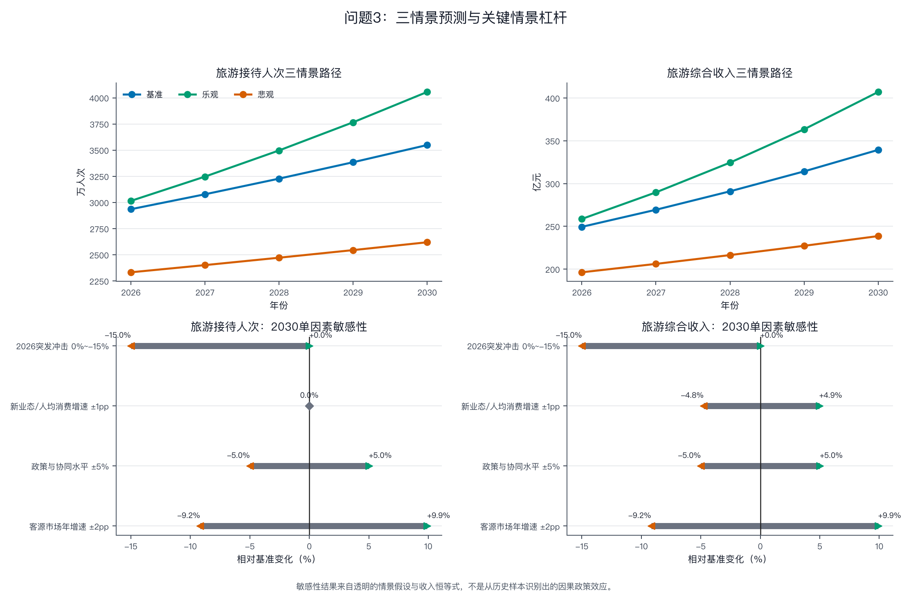

# C题：蓟州区旅游经济发展趋势预测与对策分析——Ridge 主模型实验报告

## 摘要

本报告直接对应 `docs/TJMML_C.md` 的三个问题，并以原尺度岭回归（Ridge）作为问题2的主预测模型。问题1完成2010—2025年旅游接待人次、旅游综合收入、地区生产总值和第三产业增加值的数据整理、缺失处理、异常识别与疫情前简单增长模型评价；问题2给出 Ridge 的选模依据、参数估计、统计诊断、2026—2030年点预测及95%条件置信区间，并与问题1模型进行同口径比较；问题3在 Ridge 数据驱动基准之外构造基准、乐观和悲观三种政策情景，完成关键因素敏感性分析，并形成量化对策。本文所有数值均来自仓库既有结果，本次只重组报告结构和表述，没有重新运行实验。

在未模拟官方数据的扩展窗口滚动检验中，固定 `alpha=0.1` 的原尺度 Ridge 对游客量和综合收入的 sMAPE 分别为12.919%和16.404%，两目标等权平均为14.661%，低于无断点对数线性回归的18.001%。最终 Ridge 预测2026—2030年游客量由3039.6万人次增至3887.3万人次，综合收入由241.16亿元增至296.91亿元。政策情景到2030年形成游客量2620.2—4055.8万人次、综合收入238.66—407.10亿元的边际范围；在给定扰动幅度下，客源市场增速是影响旅游总量最大的可控因素，新业态发展速度主要作用于人均消费和收入转化，外部冲击则构成最大的下行风险。

## 1. 题目要求覆盖矩阵

| 题目 | 题面要求 | 本报告直接展示的指标 | 本模型给出的核心答案 |
| --- | --- | --- | --- |
| 问题1 | 数据搜集、清洗补缺、可视化、趋势与异常、简单增长模型及适用性 | 四项指标覆盖数、缺失年份、CAGR、2023—2024增长率、补值表、简单模型参数、R²、RMSE、MAPE、AICc、LOOCV、DW、JB检验 | 疫情前游客量和收入年增长率分别为14.389%和18.487%，但疫情和统计口径断点使该模型不适合直接外推恢复期 |
| 问题2 | 选模依据、参数估计与统计检验、2026—2030预测及95%区间、合理性与模型优劣 | 滚动sMAPE、朴素基准改进率、最差单点误差、R²、调整后R²、RMSE、MAPE、AICc、DW、JB检验、Ridge系数及自助法区间、五年预测区间 | 采用原尺度 Ridge 作为主预测；2030年游客量3887.3万人次、综合收入296.91亿元，较问题1指数外推更审慎 |
| 问题3 | 基准、乐观、悲观三情景，关键因素敏感性，3—5条量化对策 | 三情景五年路径、2030年敏感性变化量和变化率、四项管理KPI及预期效果 | 基准情景2030年为3548.9万人次和339.41亿元；客源增长是主要可控总量因素，收入转化和冲击预案需同步管理 |

## 2. 数据口径、缺失处理与统一建模协议

报告使用2010—2025年年度历，并以政府统计公报、政府工作报告、蓟州区和天津市统计年鉴等23项实际引用来源构造官方优选数据层；这些来源的实际获取日期均记录为2026年8月17日。游客量统一为万人次，旅游综合收入、地区生产总值和第三产业增加值统一为亿元。每个指标每年只保留一个官方优选值，同时保留数据状态与来源编号。事实层缺失保持缺失，不以0替代；2019年宏观序列的统计口径边界单独标记，不把表观断点解释为真实经济骤降。

题目要求进行补缺，但补值不能冒充官方事实。因此，问题1的数据事实表仍保留缺失；只有问题2的模型训练层在两个已知边界之间进行双侧对数线性插值。每个预测目标最终包含2010—2024年15个训练位置，其中12个为物理证据值、3个为模拟训练值。2025年游客量和综合收入没有被生成、读取或用于训练。

| 训练目标 | 缺失年份 | 训练补值 | 插值边界 | 数据角色 |
| --- | ---: | ---: | --- | --- |
| 旅游接待人次（万人次） | 2020 | 2683.703 | 2019年2800.000；2023年2363.000 | 仅用于训练 |
| 旅游接待人次（万人次） | 2021 | 2572.236 | 2019年2800.000；2023年2363.000 | 仅用于训练 |
| 旅游接待人次（万人次） | 2022 | 2465.399 | 2019年2800.000；2023年2363.000 | 仅用于训练 |
| 旅游综合收入（亿元） | 2016 | 110.544 | 2015年94.000；2017年130.000 | 仅用于训练 |
| 旅游综合收入（亿元） | 2020 | 134.722 | 2019年165.000；2021年110.000 | 仅用于训练 |
| 旅游综合收入（亿元） | 2022 | 145.138 | 2021年110.000；2023年191.500 | 仅用于训练 |

模型评估采用扩展窗口滚动检验。每个目标有6个外层官方实际测试点，最晚测试到2023年；每个外层训练窗只能使用测试年份之前的信息。2024年单独作为单点伪留出检查，不参与选模。该伪留出不是严格前瞻测试，因为模型设计时研究者已经能够看到2024年资料。主要选模指标为原尺度 sMAPE，并以“下一年等于上一期实际值”的上一期数值法作为最低基准。

## 3. 问题1：数据趋势、异常波动与简单增长模型

### 3.1 四项指标的数据覆盖与长期趋势

| 指标 | 单位 | 有数据年份数 | 缺失年份 | 首年及数值 | 最近年份及数值 | 疫情前或分段CAGR（%） | 2023—2024增长率（%） |
| --- | --- | ---: | --- | --- | --- | --- | ---: |
| 旅游接待人次 | 万人次 | 12 | 2020、2021、2022、2025 | 2010年848.000 | 2024年2643.000 | 2010—2019年14.193 | 11.849 |
| 旅游综合收入 | 亿元 | 12 | 2016、2020、2022、2025 | 2010年35.521 | 2024年221.000 | 2010—2019年18.607 | 15.405 |
| 地区生产总值 | 亿元 | 16 | 无 | 2010年215.470 | 2025年311.940 | 2010—2018年7.408；2019—2025年6.023 | 3.662 |
| 第三产业增加值 | 亿元 | 16 | 无 | 2010年136.230 | 2025年195.170 | 2010—2018年7.014；2019—2025年6.087 | 4.424 |

旅游经济在疫情前呈快速增长，但恢复路径已经偏离原趋势。游客量2023年仍比2019年低15.607%，2024年虽同比增长11.849%，仍比2019年低5.607%；综合收入2021年比2019年低33.333%，2023年则已比2019年高16.061%，2024年继续同比增长15.405%。这说明客流恢复与收入恢复不同步。地区生产总值和第三产业增加值在2018—2019年的表观变化分别为−42.457%和−41.571%，其主要含义是统计资料口径断裂，不应解释为同幅度的真实经济衰退。

### 3.2 疫情前简单增长模型及评价指标

按照问题1要求，采用疫情前指数增长模型初步刻画发展态势：

\[
\log y_t=\beta_0+\beta_1(t-2010),\qquad g=\exp(\beta_1)-1.
\]

该模型只使用2010—2019年可用官方优选值。参数检验表明，两项目标的时间趋势项在这一疫情前样本内均不为0，但该结论不能推广为疫情后的结构稳定性。

| 目标 | 参数 | 估计值 | 标准误 | t统计量 | p值 | 95%置信区间 |
| --- | --- | ---: | ---: | ---: | ---: | --- |
| 旅游接待人次 | 截距项 | 6.801 | 0.029 | 237.455 | <0.001 | 6.735—6.867 |
| 旅游接待人次 | 时间趋势项 | 0.134 | 0.005 | 25.057 | <0.001 | 0.122—0.147 |
| 旅游综合收入 | 截距项 | 3.636 | 0.030 | 120.226 | <0.001 | 3.564—3.707 |
| 旅游综合收入 | 时间趋势项 | 0.170 | 0.006 | 29.505 | <0.001 | 0.156—0.183 |

| 目标 | 样本数 | 年增长率（%） | 对数R² | 调整后R² | 原尺度RMSE | MAPE（%） | AICc | LOOCV RMSE | DW | JB p值 |
| --- | ---: | ---: | ---: | ---: | ---: | ---: | ---: | ---: | ---: | ---: |
| 旅游接待人次 | 10 | 14.389 | 0.987 | 0.986 | 85.890 | 3.829 | -56.946 | 0.060 | 1.783 | 0.713 |
| 旅游综合收入 | 9 | 18.487 | 0.992 | 0.991 | 4.814 | 4.078 | -49.679 | 0.062 | 1.127 | 0.651 |

疫情前模型的样本内拟合较好，但机械外推会迅速放大。到2026年，该模型已经给出游客量7723.7万人次、综合收入572.50亿元；到2030年进一步升至13223.9万人次和1128.41亿元，显著超出疫情后实际恢复速度和问题3的政策情景尺度。

| 目标 | 年份 | 简单模型点预测 | 平均响应95%条件区间 | 单次预测95%条件区间 |
| --- | ---: | ---: | --- | --- |
| 旅游接待人次（万人次） | 2026 | 7723.692 | 6670.167—8943.618 | 6420.785—9290.986 |
| 旅游接待人次（万人次） | 2030 | 13223.908 | 10880.769—16071.635 | 10558.583—16562.047 |
| 旅游综合收入（亿元） | 2026 | 572.504 | 486.050—674.337 | 466.889—702.012 |
| 旅游综合收入（亿元） | 2030 | 1128.411 | 908.459—1401.616 | 880.050—1446.863 |

### 3.3 对问题1的直接回答

问题1的结论是：蓟州旅游经济在2010—2019年具有明显的指数增长特征，游客量和综合收入的估计年增长率分别为14.389%和18.487%；2020—2022年疫情冲击和2019年宏观统计口径断点构成两类性质不同的异常。简单指数模型适合描述疫情前长期态势和提供反事实趋势对照，但不适合直接承担2026—2030年主预测。旅游事实层的缺失继续保留，六个补值仅在问题2训练层使用，不能作为疫情期间的真实观测。

## 4. 问题2：Ridge 选模、参数检验与2026—2030年预测

### 4.1 模型形式与选择依据

Ridge 模型以原尺度目标为因变量，以时间趋势、2020—2022年疫情期指示变量和2023年后恢复期指示变量为解释变量。令

\[
z_t=\left(\frac{t-2010}{10},\ I(2020\le t\le 2022),\ I(t\ge 2023)\right),
\]

并在每个训练窗内标准化为设计矩阵 \(Z\)。模型求解

\[
\min_{b_0,\beta}\sum_i(y_i-b_0-Z_i\beta)^2+\lambda\lVert\beta\rVert_2^2,
\]

其中截距不惩罚，论文主规格取 `alpha=0.1`（即 \(\lambda=0.1\)）。选择原尺度 Ridge 的原因是：它能在极小年度样本下收缩高度相关的趋势与阶段系数，避免问题1指数模型长期外推过快，同时在统一滚动协议下取得较低的两目标等权误差。

| 目标 | 模型 | 测试点 | sMAPE（%） | 上一期法sMAPE（%） | 相对上一期法改进率（%） | 最差单点sMAPE（%） |
| --- | --- | ---: | ---: | ---: | ---: | ---: |
| 旅游综合收入 | Ridge，alpha=0.1 | 6 | 16.404 | 27.892 | 41.189 | 51.002 |
| 旅游综合收入 | 无断点对数线性OLS | 6 | 20.402 | 27.892 | 26.850 | 76.106 |
| 旅游综合收入 | 问题1疫情前指数模型 | 6 | 26.819 | 27.892 | 3.848 | 76.106 |
| 旅游综合收入 | 上一期数值法 | 6 | 27.892 | 27.892 | 0.000 | 54.063 |
| 旅游接待人次 | 上一期数值法 | 6 | 12.627 | 12.627 | 0.000 | 16.928 |
| 旅游接待人次 | Ridge，alpha=0.1 | 6 | 12.919 | 12.627 | -2.314 | 43.450 |
| 旅游接待人次 | 无断点对数线性OLS | 6 | 15.600 | 12.627 | -23.544 | 74.363 |
| 旅游接待人次 | 问题1疫情前指数模型 | 6 | 15.600 | 12.627 | -23.544 | 74.363 |

在未模拟官方数据轨上，Ridge、无断点OLS和上一期数值法的两目标等权 sMAPE 分别为14.661%、18.001%和20.259%。Ridge 对综合收入的改进较明确；游客量误差则比上一期法高0.292个百分点，因此模型应表述为两目标综合评价下的相对审慎主线，而不是每个目标都稳定获胜的模型。

### 4.2 参数估计与统计诊断

最终拟合使用2010—2024年15个训练位置。下表的拟合指标在各目标原尺度上计算，仅可在同一目标内解释。Ridge 是惩罚回归，不套用普通最小二乘系数的 t 检验和 p 值；参数不确定性使用固定随机种子 `20260817` 的10,000次固定设计残差自助法估计。DW和JB检验只作为残差诊断，不替代时间有序滚动回测。

| 目标 | R² | 调整后R² | RMSE | MAPE（%） | AICc | DW | JB p值 |
| --- | ---: | ---: | ---: | ---: | ---: | ---: | ---: |
| 旅游接待人次 | 0.953 | 0.941 | 141.164 | 5.357 | 160.277 | 1.356 | 0.811 |
| 旅游综合收入 | 0.971 | 0.964 | 8.905 | 7.403 | 77.379 | 2.131 | 0.956 |

| 目标 | 参数 | 标准化系数估计 | 自助法95%条件区间 | 特征训练均值 | 特征训练标准差 |
| --- | --- | ---: | --- | ---: | ---: |
| 旅游接待人次 | 截距项 | 2028.737 | 1955.836—2099.838 | — | — |
| 旅游接待人次 | 时间趋势项 | 915.628 | 763.234—1013.132 | 0.700 | 0.432 |
| 旅游接待人次 | 2020—2022年疫情期 | -227.530 | −310.164—−105.998 | 0.200 | 0.400 |
| 旅游接待人次 | 2023年后恢复期 | -396.268 | −484.326—−257.440 | 0.133 | 0.340 |
| 旅游综合收入 | 截距项 | 114.642 | 109.992—119.074 | — | — |
| 旅游综合收入 | 时间趋势项 | 60.222 | 50.683—66.358 | 0.700 | 0.432 |
| 旅游综合收入 | 2020—2022年疫情期 | -20.801 | −26.227—−13.228 | 0.200 | 0.400 |
| 旅游综合收入 | 2023年后恢复期 | -3.660 | −9.728—4.855 | 0.133 | 0.340 |

系数对应解释变量增加一个训练样本标准差后的预测变化。它们是预测参数，不是疫情或政策的因果效应。尤其是疫情期目标包含训练插值，恢复期又只有2023和2024两个真实年份，因此阶段系数的经济解释必须弱于其预测用途。2024单点伪留出中，Ridge 对游客量的MAE、MAPE和sMAPE分别为59.302万人次、2.244%和2.269%，对综合收入分别为15.495亿元、7.011%和7.266%；该结果只能说明单年方向，不能作为模型优越性的独立证明。

### 4.3 2026—2030年预测与95%区间

| 年份 | 游客量点预测（万人次） | 游客量平均响应95%条件区间 | 综合收入点预测（亿元） | 综合收入平均响应95%条件区间 |
| ---: | ---: | --- | ---: | --- |
| 2026 | 3039.552 | 2816.695—3241.784 | 241.159 | 226.710—253.346 |
| 2027 | 3251.479 | 3009.761—3459.219 | 255.098 | 239.710—267.541 |
| 2028 | 3463.405 | 3198.831—3678.913 | 269.036 | 252.505—281.971 |
| 2029 | 3675.332 | 3387.801—3901.521 | 282.975 | 265.092—296.691 |
| 2030 | 3887.259 | 3574.444—4128.023 | 296.914 | 277.361—311.606 |

这些区间是给定特征、训练补值和冻结 `alpha=0.1` 后的模型条件区间，不覆盖超参数选择、序列相关、结构变化、缺失机制、统计口径和政策变化，也不是五年同时置信带。2030年单次预测的95%条件区间为游客量3449.140—4251.025万人次、综合收入269.985—318.666亿元。

### 4.4 与问题1模型的比较及合理性判断

| 目标 | 问题1简单模型滚动sMAPE（%） | Ridge滚动sMAPE（%） | 问题1模型2030预测 | Ridge 2030预测 | 问题3情景2030边际范围 |
| --- | ---: | ---: | ---: | ---: | --- |
| 旅游接待人次（万人次） | 15.600 | 12.919 | 13223.9 | 3887.3 | 2620.2—4055.8 |
| 旅游综合收入（亿元） | 26.819 | 16.404 | 1128.41 | 296.91 | 238.66—407.10 |

Ridge 在两个目标上都比问题1简单模型具有更低的滚动 sMAPE，并且2030年预测落在问题3各指标的边际情景范围内，说明它比疫情前指数外推更符合恢复期尺度。但两个目标由独立模型拟合，不能把两个边际预测自动拼成一条联合政策情景。Ridge 的隐含名义人均次消费由2026年的793.4元降至2030年的763.8元，较2024年官方优选值836.2元下降8.65%，表现为“客流较高、收入转化偏弱”的风险组合。

### 4.5 正则化强度补充实验

`ridge` 分支在不改变目标尺度、特征和时间顺序的条件下，对 \(10^{-4}\) 至 \(10^3\) 的29个正式候选进行嵌套选择，并以0、\(10^{-6}\) 和\(10^{-5}\)作边界诊断。游客量和综合收入均选择到正式网格下界 `alpha=0.0001`，说明当前样本更接近“惩罚趋近于零”的边界信号，而不是识别出稳定的内部最优强度。

| 评估轨 | 目标 | alpha=0.1 sMAPE（%） | alpha=0.0001 sMAPE（%） | 变化（百分点） |
| --- | --- | ---: | ---: | ---: |
| 仅物理证据、严格嵌套 | 旅游接待人次 | 12.919 | 12.762 | -0.156 |
| 仅物理证据、严格嵌套 | 旅游综合收入 | 16.404 | 16.470 | +0.066 |
| 仅物理证据、两目标等权 | — | 14.661 | 14.616 | -0.045 |
| 折内重建模拟训练值 | 旅游接待人次 | 13.000 | 12.884 | -0.116 |
| 折内重建模拟训练值 | 旅游综合收入 | 16.489 | 16.555 | +0.066 |
| 折内重建模拟训练值、两目标等权 | — | 14.745 | 14.720 | -0.025 |

调参后游客量误差略降而收入误差略升，两目标平均改善只有0.025—0.045个百分点。2030年点预测仅由3887.3万人次和296.91亿元变为3924.5万人次和299.34亿元，增幅约0.96%和0.82%。因此，论文保留 `alpha=0.1` 作为已冻结主规格，将 `alpha=0.0001` 作为敏感性结果，不宣称调参带来稳定泛化提升。

### 4.6 对问题2的直接回答

问题2的答案是：在同一时间有序评估协议下，原尺度 Ridge 的两目标等权 sMAPE 最低，因此选作2026—2030年主预测模型。其2030年游客量预测为3887.3万人次，平均响应95%条件区间为3574.4—4128.0万人次；综合收入预测为296.91亿元，平均响应95%条件区间为277.36—311.61亿元。相较问题1疫情前指数模型，Ridge 的滚动误差更低、长期路径更平缓，也更接近政策情景尺度；但游客量单目标未稳定优于上一期数值法，预测区间也不包含结构和政策不确定性，故结果应作为审慎的数据驱动基准。

## 5. 问题3：三情景预测、敏感性与量化对策

### 5.1 情景设定

问题3的情景以2025年政府目标代理值为起点：游客量2800万人次、综合收入231亿元、名义人均次消费825元。它们是政策代理锚值，不是2025年实际观测。游客量依据恒等式“综合收入=游客量×人均次消费÷10000”反推，使每条情景内部保持客流、收入和消费的一致性。

| 情景 | 收入路径假设 | 人均消费路径假设 | 2026年冲击 | 政策含义 |
| --- | --- | --- | --- | --- |
| 基准情景 | 年增8% | 年增3% | 0 | 当前政策和市场自然延续 |
| 乐观情景 | 年增12% | 年增4% | 0 | 文旅升级全面落地、京津冀协同深化 |
| 悲观情景 | 2026年冲击后年增5% | 年增2% | −15% | 宏观下行或突发公共事件形成持续缺口 |

### 5.2 三情景2026—2030年预测

| 情景 | 年份 | 游客量（万人次） | 综合收入（亿元） | 名义人均次消费（元/人次） |
| --- | ---: | ---: | ---: | ---: |
| 基准 | 2026 | 2935.922 | 249.480 | 849.750 |
| 基准 | 2027 | 3078.443 | 269.438 | 875.243 |
| 基准 | 2028 | 3227.882 | 290.993 | 901.500 |
| 基准 | 2029 | 3384.575 | 314.273 | 928.545 |
| 基准 | 2030 | 3548.875 | 339.415 | 956.401 |
| 乐观 | 2026 | 3015.385 | 258.720 | 858.000 |
| 乐观 | 2027 | 3247.337 | 289.766 | 892.320 |
| 乐观 | 2028 | 3497.132 | 324.538 | 928.013 |
| 乐观 | 2029 | 3766.143 | 363.483 | 965.133 |
| 乐观 | 2030 | 4055.846 | 407.101 | 1003.739 |
| 悲观 | 2026 | 2333.333 | 196.350 | 841.500 |
| 悲观 | 2027 | 2401.961 | 206.168 | 858.330 |
| 悲观 | 2028 | 2472.607 | 216.476 | 875.497 |
| 悲观 | 2029 | 2545.330 | 227.300 | 893.007 |
| 悲观 | 2030 | 2620.193 | 238.665 | 910.867 |

Ridge 的2030年游客量3887.3万人次位于基准与乐观情景之间，而综合收入296.91亿元位于悲观与基准情景之间。其组合并不对应三条联合情景中的任何一条，反映的是客流增长快于消费转化的风险。因此，Ridge 用于提供不依赖政策锚值的数据基准，三情景用于回答政策落地与外部冲击条件下的联合路径，两者不能互相替代。

### 5.3 关键因素敏感性与核心驱动识别

敏感性分析以2030年基准值3548.875万人次和339.415亿元为参照，每次只改变一个假设。不同因素的扰动单位和宽度不同，因此下表用于比较指定情景的量级，不能解释为标准化弹性或历史因果效应。

| 因素及设定 | 2030游客量 | 游客量变化 | 2030综合收入 | 收入变化 |
| --- | ---: | ---: | ---: | ---: |
| 客源年增速提高2个百分点至6.854% | 3900.493 | +351.618（+9.908%） | 373.044 | +33.629（+9.908%） |
| 客源年增速降低2个百分点至2.854% | 3223.085 | -325.790（-9.180%） | 308.256 | -31.159（-9.180%） |
| 人均消费年增速提高1个百分点至4% | 3548.875 | 0（0%） | 356.214 | +16.799（+4.950%） |
| 人均消费年增速降低1个百分点至2% | 3548.875 | 0（0%） | 323.255 | -16.160（-4.761%） |
| 政策协同水平乘数1.05 | 3726.319 | +177.444（+5%） | 356.386 | +16.971（+5%） |
| 政策协同水平乘数0.95 | 3371.431 | -177.444（-5%） | 322.444 | -16.971（-5%） |
| 2026年无额外冲击 | 3548.875 | 0（0%） | 339.415 | 0（0%） |
| 2026年形成持续−15%缺口 | 3016.544 | -532.331（−15%） | 288.503 | -50.912（−15%） |

在给定扰动幅度下，外部冲击产生最大的下行缺口，但它属于需要防范的外生风险；可控因素中，客源市场增长同时改变游客量和收入，是总量端的核心驱动；新业态发展速度通过提高人均消费影响收入，是收入转化端的核心驱动；政策协同水平对两项目标形成相同方向的持续水平作用。由于没有历史投入成本和政策识别数据，政策协同乘数只能作为政策投入落地程度的透明代理，不能解释为投入产出因果系数。

### 5.4 量化、可操作的对策建议

| 对策 | 可执行KPI | 模型下的2030年预期效果 | 实施与监测方式 |
| --- | --- | --- | --- |
| 拓展京津冀客源市场 | 将客源年增速由基准4.854%提高至6.854% | 游客量3900.5万人次，较基准增加351.6万人次；收入373.04亿元，增加33.63亿元 | 按季度跟踪京津冀客源占比、线上搜索转化率和复游率，年度偏离目标1个百分点时调整投放 |
| 提升新业态消费转化 | 将名义人均次消费年增速由3%提高至4% | 收入356.21亿元，较基准增加16.80亿元；客流路径保持不变 | 以住宿、夜游、文创和研学产品收入占比及人均停留时长为考核指标 |
| 强化跨区域政策与产品协同 | 以2026年后路径水平乘数1.05作为压力目标 | 游客量3726.3万人次，较基准增加177.4万人次；收入356.39亿元，增加16.97亿元 | 建立交通、票务、活动和客源互送联动机制，年度核对实际路径是否达到基准的1.05倍 |
| 建立突发事件分级预案 | 把持续路径缺口控制在15%以内，并设置预订量、客单价和交通可达性触发阈值 | 若出现持续−15%缺口，2030年将少532.3万人次和50.91亿元；预案目标是避免达到该下界 | 月度监测预订、退订、住宿率和客单价，达到阈值后启动分级促销、交通保障和企业纾困 |

上述效果均为题设情景下的条件计算，不代表政策必然产生同等因果增量。实际执行时应每年把新观测值同时与 Ridge 数据基准和政策情景基准比较，并重新估计模型与情景偏差。

### 5.5 对问题3的直接回答

问题3的答案是：到2030年，悲观、基准和乐观情景分别给出2620.2、3548.9和4055.8万人次，以及238.66、339.41和407.10亿元。指定敏感性范围内，客源市场增速是最重要的可控总量因素，将其提高2个百分点可使2030年游客量和收入均增加约9.91%；人均消费增速提高1个百分点可增加收入16.80亿元；持续−15%冲击则可能造成532.3万人次和50.91亿元的缺口。因此，政策应同时配置客源拓展、消费转化、区域协同和风险预案四类工具，而不能只追求游客量总量。

## 6. 综合结论与使用边界

三个问题形成一条连续证据链。问题1说明蓟州旅游经济在疫情前高速增长，但疫情冲击、恢复结构变化和宏观统计口径断点使简单指数外推失效；问题2据此选择带阶段特征的原尺度 Ridge，将2030年预测控制在3887.3万人次和296.91亿元，并通过滚动回测、自助法区间和残差诊断展示模型性能；问题3进一步把政策和外部不确定性显式化，给出三条联合情景及可监测KPI。Ridge 是相对审慎的数据驱动基准，情景模型是条件规划工具，两者共同回答“若历史恢复趋势延续会怎样”与“若政策或冲击发生会怎样”。

结果仍受小样本、训练插值、恢复期观测不足和独立拟合两个目标的限制。所有 Ridge 区间均为模型条件区间，所有情景增量均为透明假设下的压力结果；它们不覆盖统计口径变化和政策因果不确定性。获得2025年及以后真实游客量、综合收入、过夜率和消费结构后，应按相同滚动协议重新估计模型，并检验恢复期系数和正则化强度是否仍然成立。

## 7. 结果来源与复现说明

| 内容 | 既有产物 | 本次处理 |
| --- | --- | --- |
| 题目原文 | `docs/TJMML_C.md` | 按三个问题逐项建立报告结构 |
| 问题1数据与简单模型 | `problem1_indicator_summary.csv`、`problem1_simple_growth_parameters.csv`、`problem1_simple_growth_diagnostics.csv`、`problem1_simple_growth_forecasts_2026_2030.csv` | 提取题面要求的覆盖、趋势、异常和适用性指标 |
| 问题2 Ridge 结果 | `problem2_forecasts_2026_2030.csv`、`problem2_final_model_diagnostics.csv`、`problem2_ridge_standardized_parameters.csv` | 展示选模、参数、统计诊断、预测和95%条件区间 |
| 问题3情景与敏感性 | `problem3_scenario_forecasts_2026_2030.csv`、`problem3_policy_sensitivity.csv` | 展示三情景五年路径、敏感性和量化建议 |
| 正则化补充实验 | `ridge` 分支提交 `3457e8e` 与 `outputs/ridge_optimization/` | 保留既有调参结果和图，不重新运行实验 |
| 数据来源日期 | `problem_source_access_dates.csv` | 记录23项实际使用来源，获取日期为2026-08-17 |
