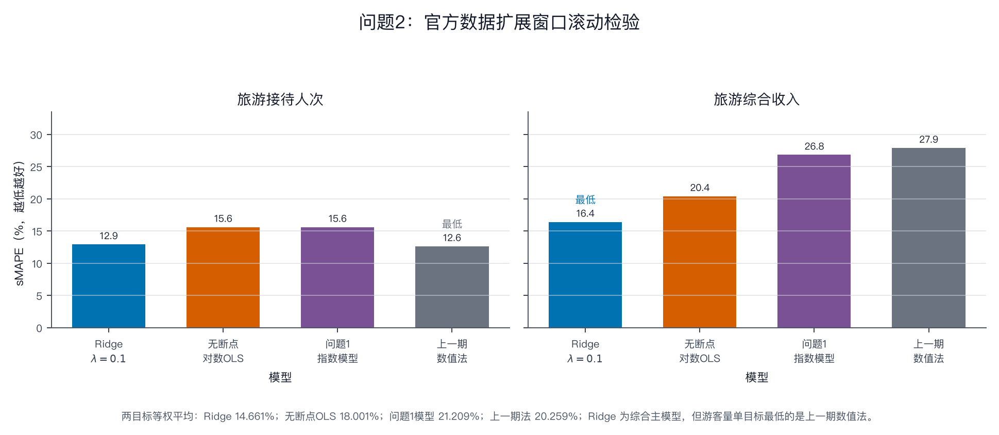
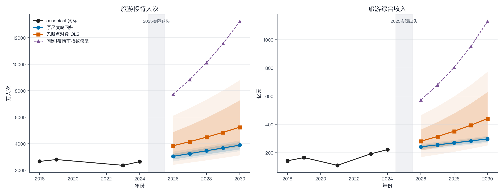
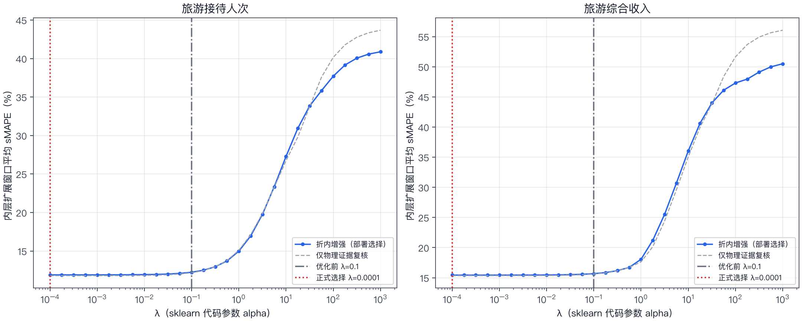
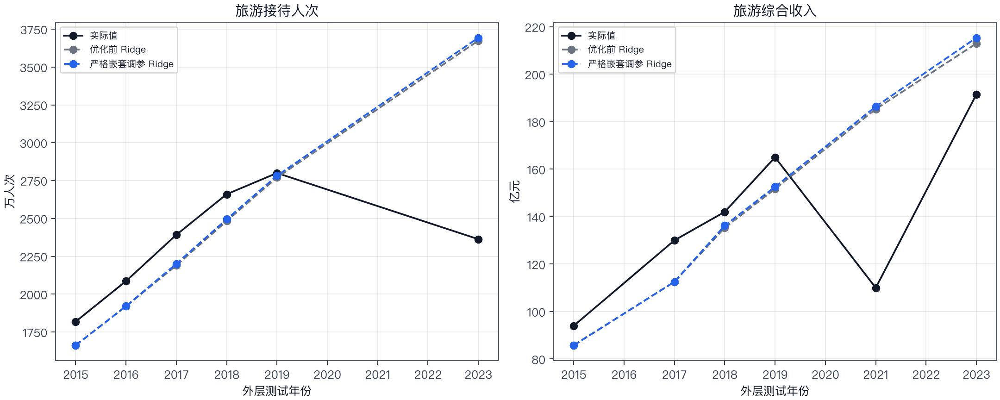
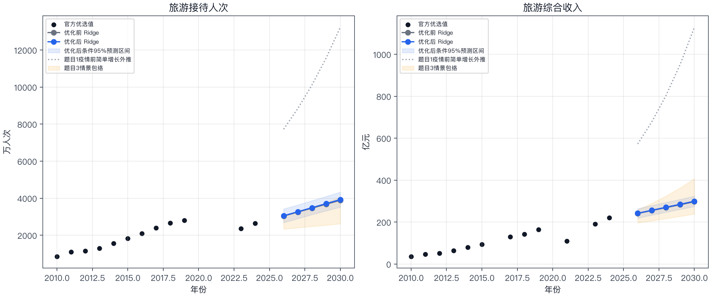

# Ridge 模型实验报告

## 1. 报告定位与结论摘要

本报告整理 `main` 分支已有的 Ridge 建模结果，并补充说明 `ridge` 分支已经完成的正则化强度实验。本次不重新运行实验，也不新增数据；所有数值均来自既有统一模型比较产物和 `ridge` 分支提交 `3457e8e` 生成的正则化调参产物。

论文中将原尺度 Ridge 作为问题2的主模型。主报告采用 `main` 中已经冻结的 `raw_target_ridge_alpha_0.1` 规格：目标变量保持原尺度，特征在训练窗内标准化，惩罚参数取 `alpha=0.1`。正则化实验对 `alpha` 进行严格时间嵌套调参，两个目标均选择到正式网格下界 `alpha=0.0001`，但样本外平均 sMAPE 仅改善 0.025—0.045 个百分点，且改善并不在两个目标上同步出现。因此，正则化实验作为参数敏感性与稳健性补充，不改变“原尺度 Ridge 为主模型”的结论，也不宜被表述为调参带来了实质性的预测能力提升。

## 2. 数据与评估协议

模型使用蓟州区旅游经济年度数据。最终拟合覆盖 2010—2024 年，共 15 个年度位置，其中 12 个为物理证据值、3 个为仅用于训练的模拟标签。模拟标签由已知边界之间的双侧对数线性插值得到；它们不作为官方事实，不进入外层测试真值，也不用于证明疫情冲击或政策效果。2025 年目标变量没有进入训练、调参或区间估计。

外层评估采用扩展窗口（expanding-origin）滚动检验：每个目标有 6 个官方实际测试点，最晚测试到 2023 年；测试年份为旅游综合收入的 2015、2017、2018、2019、2021、2023 年，以及游客量的 2015、2016、2017、2018、2019、2023 年。每个外层训练窗只使用测试年份之前的信息。2024 年只进行一次单点伪留出检查，不参与模型排序；由于研究设计和数据整理均在已看到 2024 年资料后完成，该检查不是严格意义上的前瞻未知样本。

主要评价指标为对称平均绝对百分比误差（sMAPE）。同时保留上一期数值法（`naive_last`）作为基准。两目标等权平均仅用于汇总，不把游客量和收入的绝对误差直接相加。

## 3. Ridge 模型设定

模型以时间趋势和阶段状态描述疫情前后的水平变化。令

\[
z_t=\left(\frac{t-2010}{10},\ I(2020\le t\le 2022),\ I(t\ge 2023)\right),
\]

在每个训练窗内对上述特征进行标准化，得到设计矩阵 \(Z\)。对原尺度目标 \(y\)，Ridge 的拟合目标写为

\[
\min_{b_0,\beta}\;\sum_i(y_i-b_0-Z_i\beta)^2+\lambda\lVert\beta\rVert_2^2,
\]

其中截距不参与惩罚。本实现中 `scikit-learn` 的 `alpha` 与公式中的 \(\lambda\) 表示同一个正则化强度。模型系数用于预测，不解释为疫情、政策或其他因素的因果效应；尤其是恢复期指示变量只得到 2023—2024 两个真实年份的直接支持，解释应保持谨慎。

## 4. 既有统一比较结果

### 4.1 滚动回测

在仅物理证据训练轨上，固定 `alpha=0.1` 的 Ridge 对综合收入的 sMAPE 为 16.404%，对游客量为 12.919%，两目标等权平均为 14.661%。在折内重建模拟训练标签、与最终拟合机制一致的增强轨上，对应结果分别为 16.489%、13.000% 和 14.745%。

| 训练轨 | 目标 | Ridge sMAPE（%） | 上一期法 sMAPE（%） | 相对上一期法改进率（%） |
| --- | --- | ---: | ---: | ---: |
| 仅物理证据 | 旅游综合收入 | 16.404 | 27.892 | 41.189 |
| 仅物理证据 | 旅游接待人次 | 12.919 | 12.627 | -2.314 |
| 模拟增强、折内重建 | 旅游综合收入 | 16.489 | 25.668 | 35.759 |
| 模拟增强、折内重建 | 旅游接待人次 | 13.000 | 17.785 | 26.905 |

Ridge 对综合收入相对于上一期法有明确的平均改进；对游客量，未模拟轨上略高于上一期法，但在两目标合并评价下仍优于朴素基准。由此，Ridge 的使用理由是它在小样本、阶段变化和原尺度预测之间提供了相对审慎且可复现的统一规格，而不是宣称它在每一个目标、每一个外层折上都胜出。

2024 单点伪留出中，固定 Ridge 对综合收入的 sMAPE 为 7.266%，对游客量为 2.269%。该结果只作方向性检查，不能替代多点滚动回测，也不能用于显著性判断。

### 4.2 最终拟合诊断

以下诊断针对 2010—2024 年的增强训练表，仅用于描述拟合，不替代时间有序外层评估。

| 目标 | \(R^2\) | 调整后 \(R^2\) | RMSE | MAPE（%） | DW | JB 检验 p 值 |
| --- | ---: | ---: | ---: | ---: | ---: | ---: |
| 旅游接待人次 | 0.953 | 0.941 | 141.164 | 5.357 | 1.356 | 0.811 |
| 旅游综合收入 | 0.971 | 0.964 | 8.905 | 7.403 | 2.131 | 0.956 |

上述两个目标的量纲不同，RMSE 不可横向比较。Ridge 系数不套用普通最小二乘的 t 检验和 p 值；区间估计属于给定设计和冻结参数下的残差自助法条件区间。

### 4.3 2026—2030 主预测路径

下表为 `main` 中固定 `alpha=0.1` 的点预测。游客量单位为万人次，综合收入单位为亿元。

| 年份 | 游客量点预测 | 综合收入点预测 | 游客量平均响应条件区间 | 综合收入平均响应条件区间 |
| ---: | ---: | ---: | ---: | ---: |
| 2026 | 3039.6 | 241.16 | 2816.7—3241.8 | 226.71—253.35 |
| 2027 | 3251.5 | 255.10 | 3009.8—3459.2 | 239.71—267.54 |
| 2028 | 3463.4 | 269.04 | 3198.8—3678.9 | 252.51—281.97 |
| 2029 | 3675.3 | 282.98 | 3387.8—3901.5 | 265.09—296.69 |
| 2030 | 3887.3 | 296.91 | 3574.4—4128.0 | 277.36—311.61 |

区间来自固定设计、残差可交换的 10,000 次自助法，属于模型条件区间；不覆盖超参数选择、序列相关、结构变化、缺失机制、统计口径变化和政策不确定性，也不是 2026—2030 五年同时置信带。2030 年对应的单次预测区间为游客量 3449.1—4251.0 万人次、综合收入 269.99—318.67 亿元。

## 5. 正则化强度补充实验

### 5.1 实验设计

`ridge` 分支在不改变目标尺度、特征定义和时间顺序的前提下，对 Ridge 惩罚强度进行嵌套调参。正式候选为 \(10^{-4}\) 至 \(10^3\) 的 29 个对数网格点，旧规格 `alpha=0.1` 包含在网格中；0、\(10^{-6}\) 和 \(10^{-5}\) 仅作为边界诊断。每个外层训练窗内部重新进行扩展窗口验证，外层测试仍只使用官方实际值。增强轨在每个内层折内重新构造模拟训练标签，避免把外层或未来边界的信息带入选参。

两个目标在部署一致的增强轨上都选择 `alpha=0.0001`，且均命中正式网格下界。内层平均 sMAPE 分别为游客量 11.899%、综合收入 15.439%。官方仅物理轨也选择同一下界，说明结果更接近“惩罚趋近于零”的边界信号，而不是在当前样本内识别出了一个稳定的内部最优正则化强度。

### 5.2 优化前后外层结果

| 评估轨 | 目标 | `alpha=0.1` sMAPE（%） | `alpha=0.0001` sMAPE（%） | 变化（百分点） |
| --- | --- | ---: | ---: | ---: |
| 仅物理证据、严格嵌套 | 旅游接待人次 | 12.919 | 12.762 | -0.156 |
| 仅物理证据、严格嵌套 | 旅游综合收入 | 16.404 | 16.470 | +0.066 |
| 仅物理证据、两目标等权 | — | 14.661 | 14.616 | -0.045 |
| 模拟增强、折内重建 | 旅游接待人次 | 13.000 | 12.884 | -0.116 |
| 模拟增强、折内重建 | 旅游综合收入 | 16.489 | 16.555 | +0.066 |
| 模拟增强、两目标等权 | — | 14.745 | 14.720 | -0.025 |

调参后游客量误差略有下降，但综合收入误差略有上升；两目标平均值的改善幅度很小，并且滚动折之间存在重叠，不能据此宣称稳定泛化提升。正则化实验支持的是“Ridge 结论对小范围 \(\alpha\) 变化不敏感”，而不是“更小的 \(\alpha\) 已经显著优于原规格”。

### 5.3 对未来路径的影响

若仅作参数敏感性比较，把 `alpha` 从 0.1 改为 0.0001 后，2030 年点预测由游客量 3887.3 万人次、综合收入 296.91 亿元变为游客量 3924.5 万人次、综合收入 299.34 亿元，分别增加约 37.3 万人次和 2.42 亿元，增幅约 0.96% 和 0.82%。这远小于特征规格、疫情缺失路径和情景假设可能带来的差异，因此论文正文无需把两组参数路径写成两套相互竞争的主结论。

正则化分支还做了特征消融。以 `alpha=0.0001` 事后固定到外层折的探索性结果看，2030 年游客量点预测约为 3594.3—3924.5 万人次，综合收入约为 261.58—299.34 亿元。该范围明显大于单纯调整正则化强度造成的变化；由于该消融使用了事后固定的最终参数，只用于揭示结构敏感性，不作为重新选模证据。

## 6. 结果解释与限制

第一，Ridge 的原尺度趋势是加性外推，阶段指示变量用于描述疫情期和恢复期的水平差异；它不等价于因果模型。特别是 2020—2022 年部分目标使用训练期插值标签，2023—2024 年恢复期样本也很少，恢复系数只能作为预测参数理解。

第二，正则化调参的外层训练窗很小。外层训练特征的有效秩通常只有 1—2，且截至 2023 年的外层训练窗没有 `post_2022` 正例；最终训练中恢复期也只有 2023、2024 两个年份。于是，调参主要检验时间斜率是否需要收缩，不能充分验证恢复期系数的长期稳定性。

第三，所有区间都是条件区间。残差自助法假定固定设计下残差可交换，并忽略序列相关；它没有覆盖模型结构、目标变换、缺失机制、统计口径或政策变化的不确定性。模拟标签的插值误差也不在区间内。

第四，游客量与综合收入分别拟合，因此两条点预测路径不自动满足某一条联合人均消费情景。按主规格的 2030 年点预测计算，隐含人均次消费约为 763.8 元；论文中应把它作为需要监测的结构风险，而不能把两个边际预测直接写成某一政策情景的必然结果。

## 7. 可直接写入论文的模型结论

在统一的扩展窗口滚动检验中，原尺度 Ridge 在综合收入预测上明显优于上一期数值法，在游客量上与其接近；两目标等权 sMAPE 为 14.661%，低于上一期数值法的 20.259%。因此，本文选取原尺度 Ridge 作为问题2的主预测模型，并采用训练窗内标准化、时间趋势与阶段指示变量的设定。模型给出的 2030 年游客量和综合收入点预测分别为 3887.3 万人次和 296.91 亿元。

进一步的正则化敏感性实验在严格嵌套时间验证下将两个目标的候选 `alpha` 都选至 0.0001，但相对于 `alpha=0.1`，两目标等权 sMAPE 仅在仅物理证据轨上下降 0.045 个百分点、在模拟增强轨上下降 0.025 个百分点，且综合收入单目标误差略有上升。由此，正则化实验用于说明参数敏感性和结果边界，不改变 Ridge 作为主模型的选择，也不支持将小样本下界最优解解释为普遍有效的最优正则化强度。

## 8. 结果来源与复现说明

- 主模型与预测路径：`outputs/unified_model_benchmark/problem2_forecasts_2026_2030.csv`、`outputs/unified_model_benchmark/problem2_final_model_diagnostics.csv`、`docs/unified_branch_model_comparison.md`。
- 主模型训练表：`outputs/unified_model_benchmark/problem2_final_training_2010_2024.csv`。
- 正则化补充实验：`ridge` 分支提交 `3457e8e` 中的 `docs/ridge_model_optimization_report.md` 及 `outputs/ridge_optimization/` 既有产物；本次仅整理、转写并将三张既有图纳入 `main`，没有重新运行。
- 评价口径：外层测试只使用官方实际值；模拟标签只进入对应训练折；2024 年为单点伪留出，2025 年未用于目标训练。
